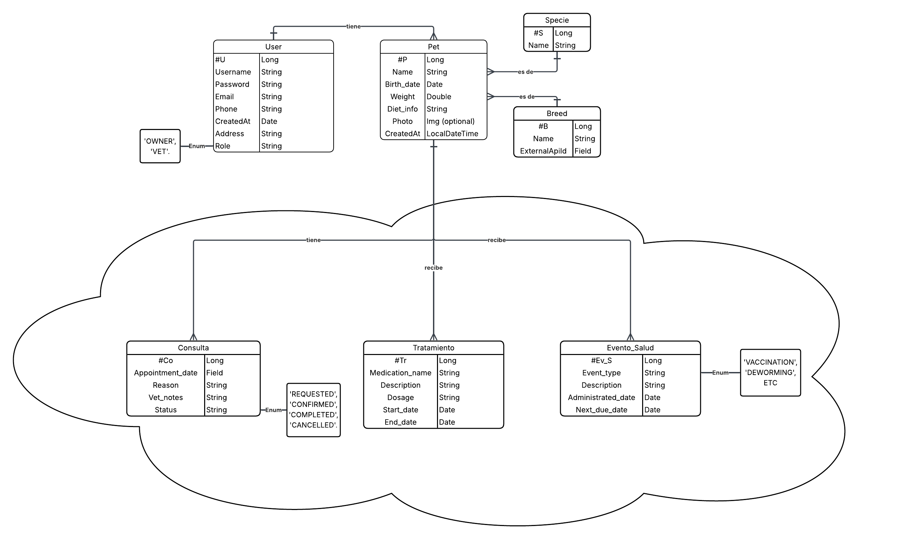

#  🧩 API Training – Spring Boot

## 📑 Índice

- [Acerca del proyecto](#acerca-del-proyecto)
- [Objetivo](#objetivo)
- [Métodos soportados](#métodos-soportados)
- [Base de datos](#base-de-datos)
- [Seguridad](#seguridad)
- [API externa](#api-externa)
- [Caché](#caché)
- [Validaciones](#validaciones)
- [Registro de logs](#registro-de-logs)
- [Manejo de errores y excepciones](#manejo-de-errores-y-excepciones)
- [Documentación](#documentación)
- [Circuit Breaker](#circuit-breaker)
- [Uso](#uso)
- [Comandos Docker](#comandos-docker)

---

## 🧠 Acerca del proyecto

Este proyecto es una **API RESTful** desarrollada con **Spring Boot**
Sigue una arquitectura por capas (**Controlador**, **Servicio**, **Repositorio**) y aplica buenas prácticas de desarrollo como seguridad, validaciones, caché y manejo centralizado de errores.

---

## 🎯 Objetivo

El objetivo del proyecto es desarrollar una **API funcional con Spring Boot** que incluya los siguientes aspectos:

1. Controlador con servicios tipo **POST**, **GET**, **PUT** o **PATCH** con acceso a una base de datos.
2. Mecanismos de **seguridad** implementados con Spring Security.
3. **Consumo de una API externa** usando `FeignClient`.
4. **Sistema de caché** para mejorar el rendimiento.
5. **Validaciones** y **registro de logs**.
6. **Manejo de errores y excepciones** personalizado y centrlizado.
7. **Documentación OpenAPI** (Swagger UI) con **springdoc-openapi**.
8. Implementación del patrón **Circuit Breaker** con **Resilience4j**.

---

## ⚙️ Métodos soportados

| **Método HTTP** | **Endpoint**           | **Descripción**                                                                             | **Respuestas esperadas**                                                                                                                                                                                       |
| ---------------------- | ---------------------------- | -------------------------------------------------------------------------------------------------- | -------------------------------------------------------------------------------------------------------------------------------------------------------------------------------------------------------------------- |
| **POST**         | `/auth/register`           | Crea un nuevo usuario. Datos en el body.                                                           | **201 Created** – Usuario creado`<br>`**400 Bad Request** – Datos mal formados`<br>`**409 Conflict** – Usuario ya existe`<br>`**422 Unprocessable Entity** – Validación fallida   |
| **POST**         | `/auth/login`              | Autentica y devuelve un token JWT.                                                                 | **200 OK** – Login exitoso`<br>`**400 Bad Request** – Solicitud inválida`<br>`**401 Unauthorized** – Credenciales incorrectas`<br>`**403 Forbidden** – Cuenta bloqueada           |
| **GET**          | `/users`                   | Lista usuarios; admite filtros (nombre, correo, etc.). Si no hay filtros devuelve todos.           | **200 OK** – Lista (puede estar vacía)`<br>`**400 Bad Request** – Filtros inválidos`<br>`**401 Unauthorized** – No autenticado`<br>`**403 Forbidden** – Sin permisos             |
| **DELETE**       | `/users/{id}`              | Elimina un usuario por ID.                                                                         | **204 No Content** – Eliminado exitosamente`<br>`**401 Unauthorized** – No autenticado`<br>`**403 Forbidden** – Sin permisos`<br>`**404 Not Found** – No existe el usuario         |
| **PATCH**        | `/users/{id}`              | Actualiza un usuario por ID. Datos en el body.                                                     | **200 OK** – Actualizado exitosamente`<br>`**401 Unauthorized** – No autenticado`<br>`**403 Forbidden** – Sin permisos`<br>`**404 Not Found** – No existe el usuario               |
| **GET**          | `/pets/my-pets`            | Obtiene las mascotas del usuario autenticado.                                                      | **200 OK** – Lista de mascotas`<br>`**401 Unauthorized** – No autenticado`<br>`**403 Forbidden** – Sin permisos                                                                             |
| **GET**          | `/pets`                    | Busca mascotas con filtros (especie, raza, etc.). Si no hay filtros, devuelve todas.               | **200 OK** – Lista (puede estar vacía)`<br>`**400 Bad Request** – Filtros inválidos`<br>`**401 Unauthorized** – No autenticado`<br>`**403 Forbidden** – Sin permisos             |
| **POST**         | `/pets`                    | Registra una nueva mascota asociada al usuario autenticado.                                        | **201 Created** – Mascota creada`<br>`**400 Bad Request** – Datos mal formados`<br>`**401 Unauthorized** – No autenticado`<br>`**422 Unprocessable Entity** – Error de validación |
| **DELETE**       | `/pets/{id}`               | Elimina una mascota por ID.                                                                        | **204 No Content** – Eliminada`<br>`**401 Unauthorized** – No autenticado`<br>`**403 Forbidden** – Sin permisos`<br>`**404 Not Found** – Mascota no encontrada                     |
| **PATCH**        | `/pets/{id}`               | Actualiza una mascota por ID. Datos en el body.                                                    | **200 OK** – Actualizado exitosamente`<br>`**401 Unauthorized** – No autenticado`<br>`**403 Forbidden** – Sin permisos`<br>`**404 Not Found** – No existe la mascota               |
| **GET**          | `/breeds`                  | Obtiene todas las razas disponibles. Admite filtros por especie. Si no hay filtros devuelve todos. | **200 OK** – Lista de razas`<br>`**401 Unauthorized** – No autenticado`<br>`**403 Forbidden** – Sin permisos                                                                                |
| **GET**          | `/species`                 | Obtiene todas las especies disponibles.                                                            | **200 OK** – Lista de especies`<br>`**401 Unauthorized** – No autenticado`<br>`**403 Forbidden** – Sin permisos                                                                             |
| **GET**          | `/api/cat-breeds`          | Obtiene lista de razas de gatos desde una **API externa**.                                    | **200 OK** – Datos obtenidos`<br>`**502 Bad Gateway** / **503 Service Unavailable** / **504 Gateway Timeout** – Error al consultar API externa                                           |
| **POST**         | `/api/cat-breeds/save-all` | Guarda todas las razas de gatos obtenidas de la API externa en la BD.                              | **201 Created** – Guardado exitoso`<br>`**409 Conflict** – Ya existen`<br>`**422 Unprocessable Entity** – Datos inválidos`<br>`**502/503/504** – Error externo                    |
| **GET**          | `/api/dog-breeds`          | Obtiene lista de razas de perros desde una **API externa**.                                   | **200 OK** – Datos obtenidos`<br>`**502/503/504** – Error externo                                                                                                                                    |
| **POST**         | `/api/dog-breeds/save-all` | Guarda todas las razas de perros obtenidas de la API externa en la BD.                             | **201 Created** – Guardado exitoso`<br>`**409 Conflict** – Ya existen`<br>`**422 Unprocessable Entity** – Datos inválidos`<br>`**502/503/504** – Error externo                    |
| **GET**          | `/v1/breeds`               | Obtiene razas de **perros** desde 'TheDogApi.                                                 | **200 OK** – Lista de razas                                                                                                                                                                                   |
| **GET**          | `/v1/breeds`               | Obtiene razas de **gatos** desde 'TheCatApi.                                                  | **200 OK** – Lista de razas                                                                                                                                                                                   |

> 🛰️ Los endpoints `/api/cat-breeds` y `/api/dog-breeds` realizan llamadas a **APIs externas** utilizando `FeignClient` a su cliente correspondiente `/v1/breeds`.

---

## 🗄️ Base de datos

- **Motor de base de datos:** MySQL
- Se utiliza **Spring Data JPA** y **Jakarta Persistence** para el mapeo objeto-relacional (ORM) y la gestión de entidades.
- **Diagrama de Entidad-Relación:**
  
- Se ha añadido paginación en las llamadas de GET para Users(usuarios) y Pets(mascotas)
- Y se han añadidos índices (aparte de los que se crean automáticamente) en las claves foráneas de la entidad 'Pet' para poder buscar por dueño, raza o especie.

---

## 🔐 Seguridad

La seguridad está implementada con **Spring Security - JWT**.
Todos los endpoints requieren autenticación previa.`<br>`
Salvo los públicos: **/auth/register** y **/auth/login**

---

## 🌍 API externa

La aplicación consume dos APIs externas en los siguientes URLs:`<br>`
https://api.thedogapi.com/v1/breeds`<br>`
https://api.thecatapi.com/v1/breeds

Esta integración se realiza mediante **FeignClient**.

---

## ⚡ Caché

Implementada caché en lógica de:

- Buscar un usuario por su nombre (búsqueda/autenticación)
- Buscar todas las razas
- Buscar todas las especies
- Buscar todas las razas de una especie

---

## ✅ Validaciones

La API cuenta con validaciones estándar y personalizadas.

- **Validaciones estándar:** `@NotNull`, `@NotBlank`, `@Size` etc.

Las solicitudes con datos inválidos generan respuestas de error estructuradas, gestionadas por el **manejador global de excepciones**.

---

## 🧾 Registro de logs

Se realizan logs con el detalle de las operaciones necesario para entender los procesos internamente.
Se realizan con:

- Spring JPA y Hibernate: proporcionan logs automáticos relacionados con las operaciones de persistencia y consultas a la base de datos (SQL ejecutadas, tiempos de ejecución, transacciones, etc.).
- SLF4J: se utiliza como capa de abstracción de logging para registrar mensajes de trazabilidad y eventos dentro de la aplicación.

---

## 🚨 Manejo de errores y excepciones

El manejo de errores se realiza de forma centralizada mediante un `@ControllerAdvice`.

**Excepciones personalizadas:**

- ``EmailTakenException`` → se lanza cuando el correo electrónico ya está registrado.
- ``EmailNotFoundException`` → se lanza cuando no se encuentra un correo electrónico en la base de datos.
- ``UsernameTakenException`` → se lanza cuando el nombre de usuario ya está registrado.
- ``UsernameNotFoundException`` → se lanza cuando no se encuentra un nombre de usuario en la base de datos.
- ``IdNotFoundException`` → se lanza cuando no se encuentra un recurso por su ID en la base de datos.
- ``BreedNotFoundException`` → se lanza cuando no se encuentra una raza en la base de datos.
- ``SpecieNotFoundException`` → se lanza cuando no se encuentra una especie en la base de datos.
- ``UserCreationException`` → se lanza cuando ocurre un error inesperado durante la creación de un usuario.
- ``RuntimeException`` → captura cualquier otra excepción no controlada.

Las respuestas de error se devuelven en formato JSON, con un mensaje claro y el código HTTP correspondiente.

---

## 📘 Documentación

La documentación de la API se genera automáticamente con **Springdoc OpenAPI** y es accesible desde un navegador web.

- **Interfaz Swagger UI:**
  👉 [http://localhost:8080/swagger-ui/index.html](http://localhost:8080/swagger-ui/index.html)

Esta interfaz permite **probar los endpoints** de manera interactiva.

También está documentada con JavaDoc todas las clases.

---

## 🔁 Circuit Breaker

Implementado Circuit Breaker en las llamadas a las APIs de **'TheDogApi'** y **'TheCatApi'**

---

## 🚀 Uso

La aplicación puede ejecutarse de forma local o dentro de un contenedor Docker.

### Requisitos previos

- **Docker** y **Docker Compose** instalados
- **Java 17** o superior
- **Maven** o **Gradle**

---

## 🐳 Comandos Docker

```bash
# Iniciar la base de datos y la aplicación
docker-compose up

# Detener los contenedores
docker-compose down
```
